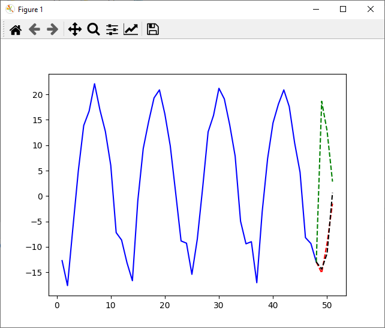

# Time Series Prediction
___
## Description
This educational project was performed at the 6th semester of study at the _USATU_ (specialty of _Mathematical software and administration of information systems_) on the subject of _Statistical modeling_.

## Installation
Each model is written in separate files, but there is also one class-file with all models for testing through the "main.py".

To test the work on Your data You need to change the name of the input file in the "main.py" and also present the data in the file as txt as shown below:
```
1 16.4
2 14.87
3 13.61
...
```
where each row ia a pair `serial number, numeric value` of means month data.

To change the number of predicted months You need to edit the parameter `predictionCount` to the appropriate value in the main file in line 7.

## Example
- Additive model - _red_;
- Multiplicative model - _green_;
- Model with dummy variables - _black_.


